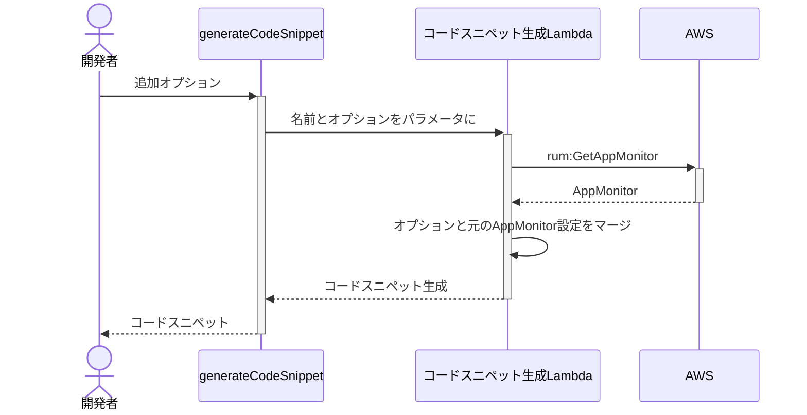

# AWS CDKが加速させる<br>WEBフロントエンドのモニタリング

<div class="pt-24">
  <span @click="$slidev.nav.next" class="px-2 py-1 rounded cursor-pointer" hover="bg-white bg-opacity-10">
    Press Space for next page <carbon:arrow-right class="inline"/>
  </span>
</div>

<div class="absolute bottom-5 right-10">
   <a href="https://github.com/WinterYukky/slides-acceralation-frontend-monitoring-by-awscdk" target="_blank" alt="GitHub" class="text-xl icon-btn opacity-50 !border-none !hover:text-white">
      <mdi-github class="text-3xl" />
    </a>
</div>

<style>
h1 {
  font-weight: 600;
  font-size: 2.7em !important;
}
</style>

---

# アジェンダ

<ul class="h-4/5 flex flex-col justify-center">
  <li class="my-3 opacity-90">AWS CDK × フロントエンド = 💖 or 💔 ?</li>
  <li class="my-3 opacity-90">Amazon CloudWatch RUM = 💖 or 💔 ?</li>
  <li class="my-3 opacity-90">AWS CDK × Amazon CloudWatch RUM = 💖 or 💔 ?</li>
</ul>

---
layout: intro
hideInToc: true
---

# 自己紹介

<div class="flex opacity-90">
  <div class="basis-1/4">
    
    <div class="py-2 text-center">
      <div class="text-4xl font-bold">吉川 幸弘</div>
      <div class="pt-1 text-2xl opacity-80">@WinterYukky</div>
    </div>
    <div class="flex justify-around px-5">
      <a href="https://github.com/WinterYukky" target="_blank" alt="GitHub" class="text-xl icon-btn opacity-50 !border-none !hover:text-white">
        <mdi-github class="text-3xl" />
      </a>
      <a href="https://twitter.com/WinterYukky" target="_blank" alt="Twitter" class="text-xl icon-btn opacity-50 !border-none !hover:text-sky-500">
        <mdi-twitter class="text-3xl text-sky-500" />
      </a>
    </div>
  </div>
  <div class="basis-3/4 pl-10">
    <ul class="text-2xl">
      <li>大阪のスタートアップ所属エンジニア</li>
      <li>普段のお仕事
        <ul class="text-xl">
          <li>お客様のAWS導入サポート</li>
          <li>プロダクト企画・開発・営業</li>
        </ul>
      </li>
      <li>好きなテクノロジー
        <ul class="text-xl">
          <li>静的型付け言語</li>
          <li>Infrastructure as Code (特にAWS CDK)</li>
        </ul>
      </li>
    </ul>
  </div>
</div>

---
layout: center
---

<div class="text-center">
  <div class="text-3xl">
    <div>今回はAWS CDKを利用した</div>
    <div>Amazon CloudWatch RUMの導入について</div>
  </div>
  <div class="opacity-70 mt-7">※RUMを導入して得た成果についてはお話しません</div>
</div>

<!-- 今回はこのAmazon CloudWatch RUMの導入にAWS CDKを利用した話をします。まだ実験的ではある -->

---

# アジェンダ

<ul class="h-4/5 flex flex-col justify-center">
  <li class="my-3 opacity-90">AWS CDK × フロントエンド = 💖 or 💔 ?</li>
  <li class="my-3 opacity-50">Amazon CloudWatch RUM = 💖 or 💔 ?</li>
  <li class="my-3 opacity-50">AWS CDK × Amazon CloudWatch RUM = 💖 or 💔 ?</li>
</ul>

---

# AWS CDKについて軽くおさらい

<div class="grid grid-cols-5 h-4/5">
  <div class="col-span-2 flex justify-center items-center">
    
  </div>
  <div class="col-span-3 flex flex-col justify-center">
    <ul>
      <li class="my-3 opacity-90">Infrastructure as Code</li>
      <li class="my-3 opacity-90">TypeScript, Python等任意の言語で記述</li>
      <li class="my-3 opacity-90">CloudFormationテンプレートを合成</li>
    </ul>
    <div v-click class="text-xl mt-5">
      <mdi-arrow-right />クラウドインフラを定義できるフレームワーク
    </div>
  </div>
</div>

---
layout: quote
class: text-center
---

# 定義だけだと不便じゃない？

---

# 定義だけじゃないAWS CDK

<div class="grid grid-cols-2 items-center h-4/5">
  <ul class="flex flex-col justify-center">
    <li class="my-2 opacity-90">ECRへイメージをプッシュ</li>
    <li class="my-2 opacity-90">S3へアセットをデプロイ</li>
    <li class="my-2 opacity-90">CloudFrontのキャッシュを無効化</li>
    <li class="my-2 opacity-90">Lambdaのビルドとデプロイ</li>
    <li class="my-2 opacity-90">etc...</li>
  </ul>
  <div>
    <div class="opacity-50 text-sm">S3へファイルをデプロイする例</div>

```ts {all|1|2|3-6|all}
const bucket = s3.Bucket(this, 'Bucket')
const asset = s3deploy.Source.asset('./asset/path')
new s3deploy.BucketDeployment(this, 'BucketDeployment', {
  sources: [asset],
  destinationBucket: bucket
});
```

  </div>
</div>

---
layout: center
---

# 静的サイト配信だって簡単

---

# SPAやSSGのビルドも可能

<div class="grid grid-cols-2 gap-7 items-center h-4/5">
  <div>
    <div class="opacity-50 text-sm mt-3">静的サイトをビルドする例</div>

```ts {all|1-4|5-18|9-15|19-22|all}
const staticSiteBucket = s3.Bucket(this, 'Bucket', {
  publicReadAccess: true,
  websiteIndexDocument: 'index.html'
})
const staticSite = s3deploy.Source.asset('../frontend', {
  bundling: {
    image: DockerImage.fromRegistry('node'),
    local: {
      tryBundle: (outputDir) => {
        // 任意のビルドプロセス
        spawnSync('yarn', ['generate', outputDir], {
          stdio: 'inherit',
        })
        return true
      }
    }
  }
})
new s3deploy.BucketDeployment(this, 'BucketDeployment', {
  sources: [staticSite],
  destinationBucket: staticSiteBucket
});
```

  </div>
  <ul class="flex flex-col justify-center">
    <li class="my-2 opacity-90">複雑さをパイプラインから分離可能</li>
    <li class="my-2 opacity-90">TypeScriptでロジカル処理も楽</li>
    <li class="my-2 opacity-90">ライブラリ化して使う事も</li>
  </ul>
</div>

---

# フロントエンドをAWS CDKで管理するメリット

<ul class="h-4/5 flex flex-col justify-center">
  <li v-click class="my-4 opacity-90">フロントエンドエンジニアが慣れているTypeScriptで記述できる</li>
  <li v-click class="my-4 opacity-90">Amplify等では難しい細かいカスタマイズが容易</li>
  <li v-click class="my-4 opacity-90">カスタマイズ可能な割に構築難易度も低い</li>
  <li v-click class="my-4 opacity-90">どのようなAWSリソースで構築されているか把握しやすい</li>
</ul>

<!-- Amplifyはとても便利だがカスタマイズしようとすると骨が折れる思いをすることも -->

---
layout: section
---

# AWS CDK × フロントエンド = 💖

<style>
h1 {
  font-size: 2.7em !important;
}
</style>

---

# アジェンダ

<ul class="h-4/5 flex flex-col justify-center">
  <li class="my-3 opacity-50">AWS CDK × フロントエンド = 💖 or 💔 ?</li>
  <li class="my-3 opacity-90">Amazon CloudWatch RUM = 💖 or 💔 ?</li>
  <li class="my-3 opacity-50">AWS CDK × Amazon CloudWatch RUM = 💖 or 💔 ?</li>
</ul>

---

# Amazon CloudWatch RUMとは

<div class="grid grid-cols-5 items-center h-4/5">
  <ul class="flex flex-col justify-center col-span-2">
    <li class="my-1 opacity-90">Amazon CloudWatchの新機能</li>
    <li class="my-1 opacity-90">2021年末のAWS re:Inventで発表</li>
    <li class="my-1 opacity-90">ユーザーの体験を分析・可視化
      <ul>
        <li>エラー</li>
        <li>HTTP</li>
        <li>パフォーマンス</li>
        <li>インタラクション</li>
        <li>アクセス元</li>
        <li>アクセス経路</li>
        <li>etc...</li>
      </ul>
    </li>
  </ul>
  <div class="col-span-3">
    
  </div>
</div>

<style>
li {
  font-size: 1.3rem !important;
}
li li {
  font-size: 1rem !important;
}
</style>

---

# Amazon CloudWatch RUMの利用イメージ

<div class="h-4/5 mt-10 flex justify-center">
  
</div>

---

# Amazon CloudWatch RUMのコードスニペット

マネジメントコンソールからすぐに取得可能

<div class="h-4/5 mt-7 flex justify-center">
  
</div>

---

# Amazon CloudWatch RUMの導入方法

<div class="grid grid-cols-3 h-4/5 items-center text-center">
  <div class="grid grid-rows-3 items-center">
    <div class="opacity-90">Step 1</div>
    <div class="flex justify-center items-center h-30">
      
    </div>
    <div class="font-bold text-xl">AppMonitorを作成</div>
  </div>
  <div class="grid grid-rows-3 items-center">
    <div class="opacity-90">Step 2</div>
    <div class="text-8xl h-30 text-yellow-400 flex justify-center items-center">
      <mdi-language-javascript />
    </div>
    <div class="font-bold text-xl">コードスニペットを取得</div>
  </div>
  <div class="grid grid-rows-3 items-center">
    <div class="opacity-90">Step 3</div>
    <div class="text-8xl h-30 text-gray-400 flex justify-center items-center">
      <mdi-pencil />
    </div>
    <div class="font-bold text-xl">アプリケーションに埋め込み</div>
  </div>
</div>

---
layout: section
---

# Amazon CloudWatch RUM = 💖

<style>
h1 {
  font-size: 2.7em !important;
}
</style>

---

# アジェンダ

<ul class="h-4/5 flex flex-col justify-center">
  <li class="my-3 opacity-50">AWS CDK × フロントエンド = 💖 or 💔 ?</li>
  <li class="my-3 opacity-50">Amazon CloudWatch RUM = 💖 or 💔 ?</li>
  <li class="my-3 opacity-90">AWS CDK × Amazon CloudWatch RUM = 💖 or 💔 ?</li>
</ul>

---
title: 導入決定
layout: section
---

# とあるプロジェクトですぐ導入することに

<style>
  h1 {
    font-size: 2.4em !important;
}
</style>

<!-- 元々フロントエンドのエラーログ収集にSentryを検討していた事もあってかなり好意的でした -->

---
layout: section
---

# そこで課題が・・・

<style>
  h1 {
    font-size: 2.4em !important;
}
</style>

---
layout: section
---

## CloudFormationはAppMonitorの<br >コードスニペット・IDの取得をサポートしていない

<div class="opacity-70 mt-5">※2022年2月22日現在の情報</div>

<style>
h1 {
  font-size: 2.7em !important;
}
</style>

---

# コードスニペットを自作するにもIDは必須

```html {all|11}
<script>
(function(n, i, v, r, s, c, x, z) {
    x = window.AwsRumClient = { q: [], n: n, i: i, v: v, r: r, c: c };
    window[n] = function(c, p) { x.q.push({ c: c, p: p }); };
    z = document.createElement('script');
    z.async = true;
    z.src = s;
    document.h
    ead.insertBefore(z, document.getElementsByTagName('script')[0]);
})('cwr',
    '<AppMonitorId>',
    '1.0.0',
    '<region>',
    'https://client.rum.us-east-1.amazonaws.com/1.0.2/cwr.js', {
        sessionSampleRate: 1,
        guestRoleArn: "arn:aws:iam::123456789012:role/RUM-Monitor-<region>-123456789012-9999999999999-Unauth",
        identityPoolId: "<region>:XXXXXXXX-YYYY-ZZZZ-AAAA-BBBBBBBBBBBB",
        endpoint: "https://dataplane.rum.<region>.amazonaws.com",
        telemetries: ["performance", "errors", "http"],
        allowCookies: true,
        enableXRay: true
    });
</script>
```

---
layout: center
class: text-center
---

# もしかして環境毎に<br>コンソールへアクセスする必要がある？

---
layout: section
clicks: 1
---

<div>
  <div class="text-4xl font-black target-text">値<span class="text-3xl">が</span>使えない<span class="text-2xl">なら</span></div>
  <div class="text-3xl">AWS CDK × Amazon CloudWatch RUM = 💔 ?</div>
</div>

<!-- チャンバー -->
<div class="absolute bottom-2 left-5 text-red-500 opacity-70">
  <!-- <mdi-cog class="chamber text-9xl"/> -->
  
</div>
<!-- ダンガン -->
<div class="absolute bottom-10 left-23" >
  <div class="bullet opacity-90 text-sm font-bold rounded-r-2xl bg-red-100 text-black border-solid border-2 border-red-600 flex divide-x-2 divide-red-600 rotate-12">
    <div class="px-2"></div><div class="pl-2 pr-4">カスタムリソース</div>
  </div>
</div>

<div class="absolute top-5 left-10 italic">
  <div class="text-left opacity-60">WinterYukky</div>
  <div class="text-left mt-3 opacity-80">・・・<span class="font-bold text-yellow-400 ">・</span>・・・</div>
</div>

<div class="absolute top-5 right-27 italic">
  <div class="text-left opacity-30">status</div>
</div>
<div class="absolute top-10 right-10">
  <div>
    <mdi-heart class="text-pink-500 opacity-50 -mx-0.3" />
    <mdi-heart class="text-pink-500 opacity-50 -mx-0.3" />
    <mdi-heart class="text-pink-500 opacity-50 -mx-0.3" />
    <mdi-heart class="text-pink-500 opacity-50 -mx-0.3" />
    <mdi-heart class="text-pink-500 opacity-50 -mx-0.3" />
  </div>
  <div class="-mt-1">
    <mdi-star class="text-green-300 opacity-50 -mx-0.3" />
    <mdi-star class="text-green-300 opacity-50 -mx-0.3" />
    <mdi-star class="text-green-300 opacity-50 -mx-0.3" />
    <mdi-star class="text-green-300 opacity-50 -mx-0.3" />
    <mdi-star class="text-green-300 opacity-50 -mx-0.3" />
  </div>
</div>

<div
  v-if="$slidev.nav.clicks >= 1"
  class="absolute top-40 -left-10 w-6/5"
  v-motion-slide-right
>
  <div 
  class="text-12xl text-black py-8 refutation"
  >
    <div class="flex justify-around">論破</div>
  </div>
</div>

<style>
.target-text {
  color: #FFBE00;
  background: -webkit-linear-gradient(top, #FFDA00 0%, #FFA73D 50%, #FFBE00 51%, #FF7F04 100%);
  -webkit-background-clip: text;
  -webkit-text-fill-color: transparent;
  font-weight: 1000;
}

.chamber {
  transform: rotateY(30deg) rotateX(30deg);
}

.bullet {
  transform: rotate(-4deg);
}

h1 {
  font-size: 2.2em !important;
}

.refutation {
  transform: rotate(8deg);
  background-color: #6CBDCD;
}

</style>

---
layout: center
---

# こんな時はカスタムリソース

---

# カスタムリソース？

<div class="grid grid-cols-2 items-center h-4/5">
  <ul class="flex flex-col justify-center">
    <li class="my-2 opacity-90">CloudFormationの機能</li>
    <li class="my-2 opacity-90">Lambdaで任意の仕組みを作れる</li>
    <li class="my-2 opacity-90">出力はそのまま値として利用可能</li>
    <li class="my-2 opacity-90">AWS CDKだと簡単に使える</li>
  </ul>
  <div>
    <div class="opacity-50 text-sm">CustomResourceの使用例</div>

```ts {all|3-5|6-9|2,12|all}
// JSONオブジェクトをレスポンスするLamnda
// 例: { Status: "SUCCESS", Data: { MyValue: "WinterYukky" } }
const myFunction = new lambda.NodejsFunction(this, 'MyFunc', {
  entry: './my-custom-resource/index.ts'
})
const customResource = new CustomResource(this, 'Custom', {
  resourceType: 'Custom::MyResource',
  serviceToken: myFunction.functionArn
});

// レスポンスのDataからのパスでアクセス
customResource.getAttString('MyValue'); // WinterYukky
```

  <div class="opacity-20 text-xs">※実際にはいくつかの必須項目もレスポンスする必要あり</div>
  </div>
</div>

---
layout: section
---

# カスタムリソースでL2コンストラクトを作成

<style>
h1 {
  font-size: 2.2em !important;
}
</style>

---

# 作成したL2コンストラクト

<div class="grid grid-cols-5 gap-7 items-center h-4/5">
  <div class="col-span-3">
    <div class="opacity-50 text-sm">L2コンストラクトの使用例</div>

```ts {all|1-11|13-16|all}
const appMonitor = new rum.AppMonitor(this, 'AppMonitor', {
  domain: 'amazon.com',
  appMonitorName: 'amazon.com',
  appMonitorConfiguration: {
    telemetries: [
      rum.Telemetry.PERFORMANCE,
      rum.Telemetry.ERRORS,
      rum.Telemetry.HTTP,
    ]
  }
})

// (function(n,i,v,r,s,c,x,z){...})
const codeSnippet = appMonitor.generateCodeSnippet('CodeSnippetId', {
  // advanced options here
})
```

  </div>
  <ul class="flex flex-col justify-center col-span-2">
    <li class="my-2 opacity-90">コードスニペット生成機能</li>
    <li class="my-2 opacity-90">Cognito Idpの自動生成</li>
    <li class="my-2 opacity-90">必要なポリシーの割り当て</li>
  </ul>
</div>

---
class: py-10 pr-0
---

# 仕組み

<div class="grid grid-cols-5 py-4">
  <div class="mt-12 col-span-2">
    <ul>
      <li>カスタムリソースを作成</li>
      <li>任意のオプションを渡す</li>
      <li>デプロイ時にLambdaが呼ばれる
        <ol>
          <li>AWS SDKで実際のRUMを取得</li>
          <li>オプションとRUMの設定をマージ</li>
          <li>コードスニペット生成</li>
        </ol>
      </li>
    </ul>
  </div>
  <div class="bg-white col-span-3 -mt-28">



  </div>
</div>

<style>
li {
  font-size: 1.4rem !important;
}
li li {
  font-size: 1.2rem !important;
}
</style>

---

# どうやって使う？
生成されたコードスニペットをJSファイルとしてS3バケットにデプロイすればOK?

```ts {2|3-13|14-17|all}
// AppMonitorやS3バケットの定義は省略
const codeSnippet = appMonitor.generateCodeSnippet('CodeSnippetId')
const rumJs = s3deploy.Source.asset('./', {
  bundling: {
    image: DockerImage.fromRegistry('alpine'),
    local: {
      tryBundle: (outputDir) => {
        fs.writeFileSync(path.join(outputDir, 'rum.js'), codeSnippet)
        return true
      }
    }
  }
})
new s3deploy.BucketDeployment(this, 'BucketDeployment', {
  sources: [rumJs],
  destinationBucket: myWebSiteBucket
});
```

---
layout: center
---

# ここでCDKユーザーはある点が気になるはず

---
layout: center
---

# Q. これはトークンがアップロードされるのでは？

---
layout: center
---

# A. そう、トークンがアップロードされる

---

# トークンについておさらい

<div class="grid grid-cols-2 gap-7 items-center h-4/5">
  <ul class="flex flex-col justify-center opacity-90">
    <li class="my-2 opacity-90">CDKのコード実行中に使用される値</li>
    <li class="my-2 opacity-90">デプロイ時に解決される</li>
    <li class="my-2 opacity-90">実行時に実際の値は利用不可</li>
    <li class="my-2 opacity-90">利用する場合はCfnOutputを使う</li>
  </ul>
  <div>
    <div class="opacity-50 text-sm">トークンを出力する例</div>

```ts {all|1-4|6-7|all}
const bucket = s3.Bucket(this, 'Bucket', {
  publicReadAccess: true,,
  websiteIndexDocument: 'index.html'
})

// これだと ${Token[TOKEN.228]} のような文字列が出力される
console.log(bucket.bucketWebsiteDomainName)
```

  </div>
</div>

---
layout: center
---

# それを解決するのが最近リリースされた機能

---

# s3-deploymentの新機能

<div class="grid grid-cols-5 gap-4 h-4/5 justify-center items-center">
  <ul class="col-span-2 opacity-90">
    <li>v2.11.0でリリース</li>
    <li>実際の値をデプロイする</li>
    <li>現在は2種類
      <ul>
        <li>Source.data()</li>
        <li>Source.jsonData()</li>
      </ul>
    </li>
  </ul>
  <div class="col-span-3">
    
  </div>
</div>

---
layout: center
---

# これでCDK単体でアップロード可能に

---

<div class="mb-5">

# RUMを導入した最低限のWEBサイト構築例

</div>

```ts {1-5|6-9|10|11-17|19-22|all}
const webSiteBuclet = new s3.Bucket(this, 'WebSiteBucket', {
  bucketName: 'xxxxxx',
  publicReadAccess: true,
  websiteIndexDocument: 'index.html'
})
const appMonitor = new rum.AppMonitor(this, 'AppMonitor', {
  domain: webSiteBuclet.bucketWebsiteDomainName,
  appMonitorName: 'my-app-monitor',
})
const codeSnippet = appMonitor.generateCodeSnippet('CodeSnippet');
const rumJs = s3deploy.Source.data('rum.js', codeSnippet);
const html = s3deploy.Source.data('index.html', `<html>
  <head>
    <script src="/rum.js" async="true"></script>
  </head>
  <body>Hello RUM</body>
</html>`);

new s3deploy.BucketDeployment(this, 'BucketDeployment', {
  sources: [html, rumJs],
  destinationBucket: myWebSiteBucket
});
```

---
layout: section
---

# プロジェクトへのRUM導入がスピーディに！

<style>
h1 {
  font-size: 2.2em !important;
}
</style>

---
layout: section
---

# AWS CDK × Amazon CloudWatch RUM = 💖

---

# さいごに

<ul class="h-4/5 flex flex-col justify-center opacity-90">
  <li class="my-2">AWS CDKはRUM導入を加速させる</li>
  <li class="my-2">s3-deploymentに未来を感じた</li>
  <li class="my-2">紹介したL2コンストラクトはRFCを提出して現在レビューフェーズ</li>
  <li class="my-2">今回のプレゼン資料は後でリンクをツイート予定
    <ul>
      <li class="my-1">資料はSlidevを使ってmarkdown管理を実現</li>
      <li class="my-1">気になる方は <a href="https://twitter.com/WinterYukky" target="_brank" class="text-sky-500"><mdi-twitter class="text-2xl text-sky-500 mr-1" />@WinterYukky</a> まで</li>
    </ul>
  </li>
</ul>

---
layout: statement
---

# ご清聴ありがとうございました
